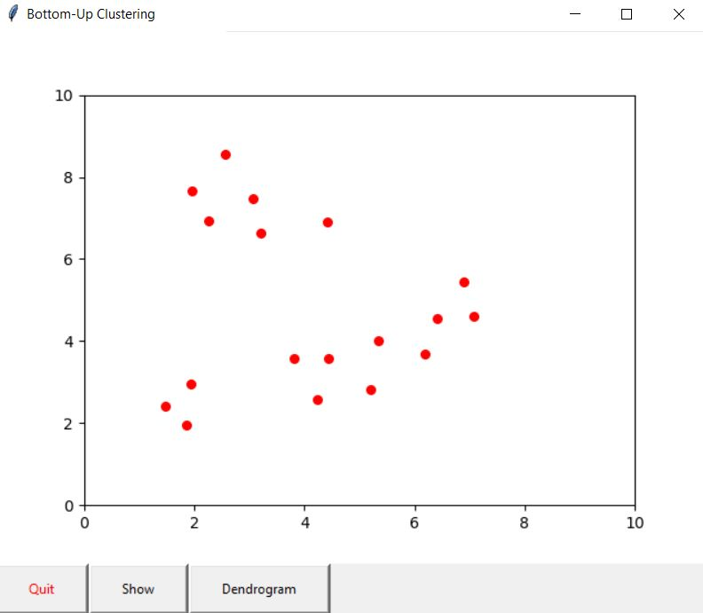

# ML_Bottom-Up_Clustering

Visualisation of bottom-up clustering algorithms.

Also, hierarchy.py imitates https://docs.scipy.org/doc/scipy/reference/generated/scipy.cluster.hierarchy.linkage.html.

To run the application, you need to run cluster.py in the same folder with the other .py files in the project.

For example: py cluster.py single euclidean will run the program using the single linkage method with the euclidean metric.
The user will be able to plot points on the graph using the mouse or use the random button which will plot 10 points with random coordinates.
After plotting the points and running the algorithm, you can use the show button which will change the colour of the points sequentially, based on which cluster contains it.
Also, the program can plot the dendrogram of the given dataset.

